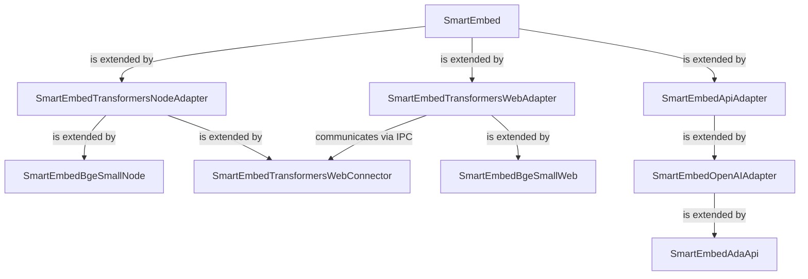

# Smart Embed
Conveniently embed content with a standardized interface that works with various local and remote embedding models.

## Development
- `node build_web.js` is used to compile the web connector for loading via the web adapter.